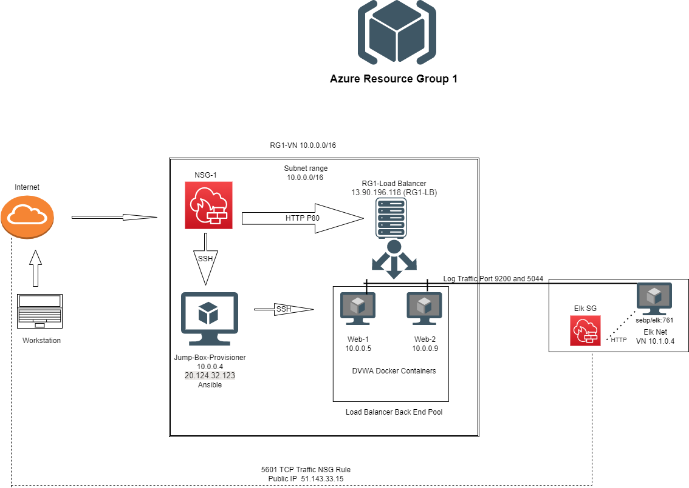
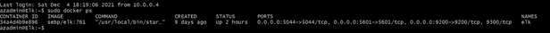

## Automated ELK Stack Deployment

The files in this repository were used to configure the network depicted below.

This document contains the following details:
- Description of the Topology
- Access Policies
- ELK Configuration
  - Beats in Use
  - Machines Being Monitored
- How to Use the Ansible Build

### Description of the Topology

The main purpose of this network is to expose a load-balanced and monitored instance of DVWA, the D*mn Vulnerable Web Application.

Load balancing ensures that the application will be highly available, in addition to restricting access to the network. They reduce latency and upgrade user experience. 
By improving application performance, Load Balancing steers users from unhealthy servers and towards most available and responsive server pools.
Load balancers protect applications from emerging threats, authenticate user access, protect against DDoS attacks, simplify PCI compliance, insure traffic compression and caching, support HTTP 2.0, and help with SSL offloading. The advantage of using a jump box is that it provides a secure computer for all admins to connect to before launching administrative tasks. A jump box has only a ssh path in and no other protocols are allowed outbound. 

Integrating an ELK server allows users to easily monitor the vulnerable VMs for changes to the metrics and system files.
Filebeat watches for changes in system file structures.
Metricbeat records metrics from the OS and from services.

The configuration details of each machine may be found below.

| Name     | Function | IP Address | Operating System |
|----------|----------|------------|------------------|
| Jump Box | Gateway  | 10.0.0.4   | Linux            |
| Web 1    | Host     | 10.0.0.5   | Linux            |
| Web 2    | Host     | 10.0.0.9   | Linux            |
| Elk      | Met./log | 10.1.0.4   | Linux            |

### Access Policies

The machines on the internal network are not exposed to the public Internet. 

Only the Jumpbox machine can accept connections from the Internet. Access to this machine is only allowed from the following whitelisted IP: 73.162.34.230

Machines within the network can only be accessed by Jumpbox 10.0.0.4.
Machines on IP:73.162.34.230 have access to my ELK VM.

A summary of the access policies in place can be found in the table below.

| Name     | Publicly Accessible | Allowed IP Addresses |
|----------|---------------------|----------------------|
| Jump Box | Yes/No              | My IP address            |
| Web 1    | No                  | 10.0.0.5             |
| Web 2    | No                  | 10.0.0.9             |
| Elk      | Yes                 | 10.1.0.4             |

### Elk Configuration

Ansible was used to automate configuration of the ELK machine. No configuration was performed manually, which is advantageous because automation helps save time and money.
The main advantage of automating configuration with Ansible is that you can set up multiple servers from a single playbook.

The playbook implements the following tasks:
- Install: docker.io
- Install: python-pip
- Command: sysctl -w vm.max_map_count=262143
- Launch : elk

The following screenshot displays the result of running `docker ps` after successfully configuring the ELK instance.

### Target Machines & Beats
This ELK server is configured to monitor the following machines:
- Web 1:10.0.0.5
- Web 2:10.0.0.9

We have installed the following Beats on these machines:
- Filebeat
- Metricbeat
(Images/monitoring.png)
(Images/monitoring2.png)
(Images/monitoring3.png)

These Beats allow us to collect the following information from each machine:
- Monitor file changes to the system.
- Monitor metric changes to the system. 

### Using the Playbook
In order to use the playbook, you will need to have an Ansible control node already configured. Assuming you have such a control node provisioned: 

SSH into the control node and follow the steps below:
- Copy the filebeat-configuration.yml to ansible directory.
- Update the /etc/ansible/host file to add web server and elk server Ips.
- Run the playbook:
Ansible-playbook filebeat-configuration.yml
-navigate to URL and check that the installation worked as expected.
(Images/ansible.png)

http://51.143.33.15:5601/app/kibana#/home
(Images/kibana.png)

Commands Used
sudo docker start elk
sudo docker run -p 5601:5601 -p 9200:9200 -p 5044:5044 -it --name elk sebp/elk:761
docker container list -a
curl https://gist.githubusercontent.com/slape/5cc350109583af6cbe577bbcc0710c93/raw/eca603b72586fbe148c11f9c87bf96a63cb25760/Filebeat > /etc/ansible/filebeat-config.yml
dpkg -i filebeat-7.4.0-amd64.deb
metricbeat modules enable docker
metricbeat setup
ssh-keygen -p -f ~/.ssh/id_rsa
ansible_python_interpreter=/usr/bin/python3
touch /etc/ansible/install-elk.yml
vm.max_map_count to 262144
sudo docker ps
curl http://localhost:5601/app/kibana
nmap -p 80 <elk.vm.external.ip>
